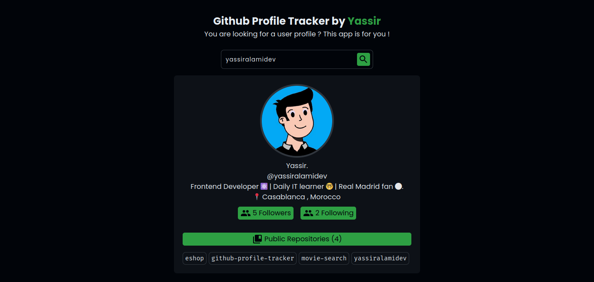

# 🔍 GitHub Profile Tracker

GitHub Profile Tracker is a web application that helps you retrieve and display information about GitHub users quickly and conveniently. Simply enter a GitHub username, and the app will fetch and present the user's profile details along with their repositories in a user-friendly interface.


## 👀 Demo

[Link to Live Demo](https://github-profile-tracker.netlify.app/)

*Caption: This is a screenshot of my project.*

## ⭐ Features

- Enter a GitHub username to retrieve user details.
- Display user's profile picture, name, bio, location, and more.
- Show the number of followers, following, and public repositories.
- List the user's repositories with details such as name and description.

## 🤓 Getting Started

Follow these instructions to get a copy of the project up and running on your local machine for development and testing purposes.

### 🤔 Prerequisites

- [Node.js](https://nodejs.org/) installed on your machine.
- A GitHub Personal Access Token.

### 💻 Installation

1. Clone the repository:

   ```bash
   git clone https://github.com/yassiralamidev/github-profile-tracker.git
   ```

2. Navigate to the project directory:

   ```bash
   cd github-profile-tracker
   ```

3. Install the project dependencies:

   ```bash
   npm install
   ```

4. Go to the `.env` file in the root directory of your project and add your GitHub Personal Access Token:

   ```env
   VITE_GITHUB_TOKEN==your_access_token_here
   ```

5. Start the development server:

   ```bash
   npm run dev
   ```

6. Open your web browser and go to `http://localhost:5173` to use the app locally.

## ⚙ Usage

1. Enter a GitHub username in the input field and click the "Search" button.
2. The app will fetch and display the user's GitHub profile information, including their avatar, name, bio, and more.
3. You can also view the user's public repositories, along with their names and descriptions.

## 🔧 Technologies Used

- React
- Axios
- Material-UI (for icons)
- GitHub API

## 🤝 Contributing

Contributions are welcome! If you'd like to contribute to this project, please follow these guidelines:

1. Fork the repository.
2. Create a new branch for your feature or bug fix.
3. Make your changes and test thoroughly.
4. Commit your changes with clear and concise messages.
5. Push your changes to your fork.
6. Create a pull request to the main repository.


